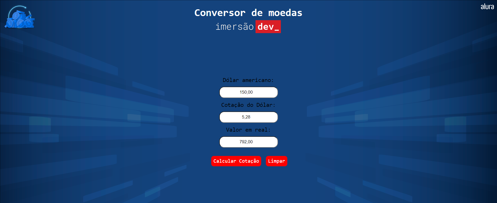

<h1 align="center">Conversor de Moedas</h1>

Imersão Dev é um evento exclusivo e gratuito, promovido pela Alura para ensino de tecnologias WEB.  

  <a href="#-tecnologias">Tecnologias</a>     |    
  <a href="#-projeto">Projeto</a>     |    
  <a href="#-layout">Layout</a>     |    
  <a href="#-licença">Licença</a>

  

 

  

## 🚀 Tecnologias

Esse projeto foi desenvolvido com as seguintes tecnologias:

- HTML
- CSS
- JavaScript
- Git
- Github
- CodePen

## 💻 Projeto

O Conversor de Moedas é uma página web que converte o valor de dólar para real, de acordo com a cotação do dia. Seja para conversão de valores para produtos ou para câmbio.

- [ Visite o projeto online ](https://lipeharakawa.github.io/conversor-dolar)

## 🔖 Layout

Você pode visualizar o layout do projeto através de [ DESSE LINK ](https://codepen.io/imersao-dev/pen/BapaBPO). É necessário ter conta no [ CodePen ](https://codepen.io/accounts/signup/user/free) para acessá-lo.

## ✅ Licença

Esse projeto está sob a licença MIT.

---

Feito com ❤️ por Felipe Seidi Harakawa.
